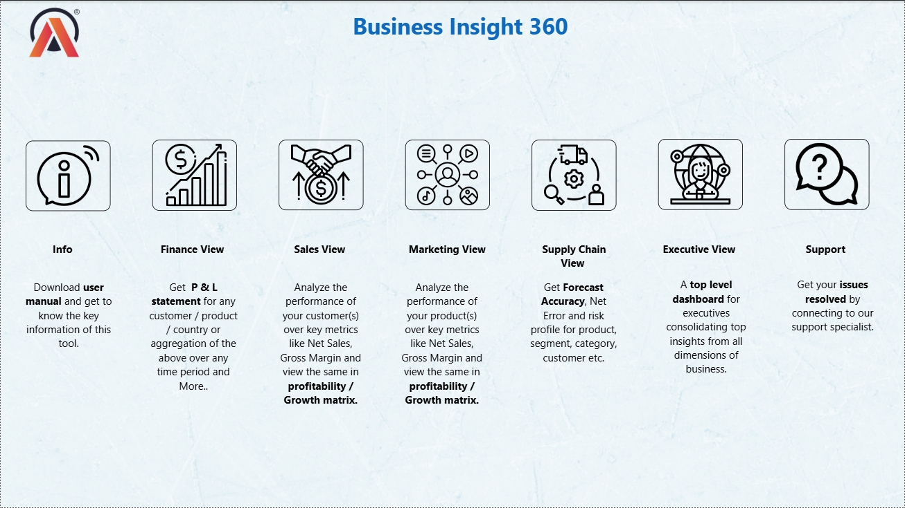
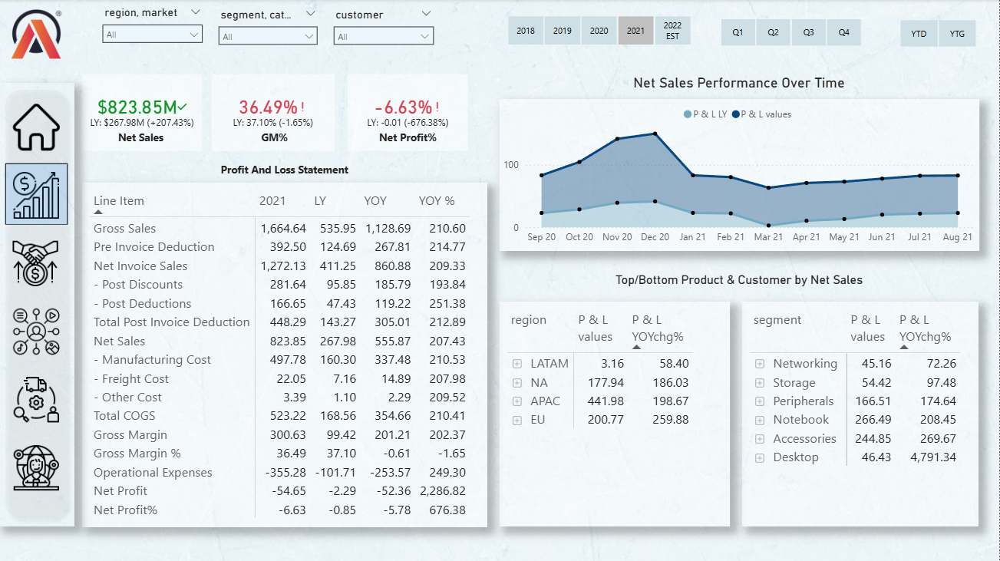
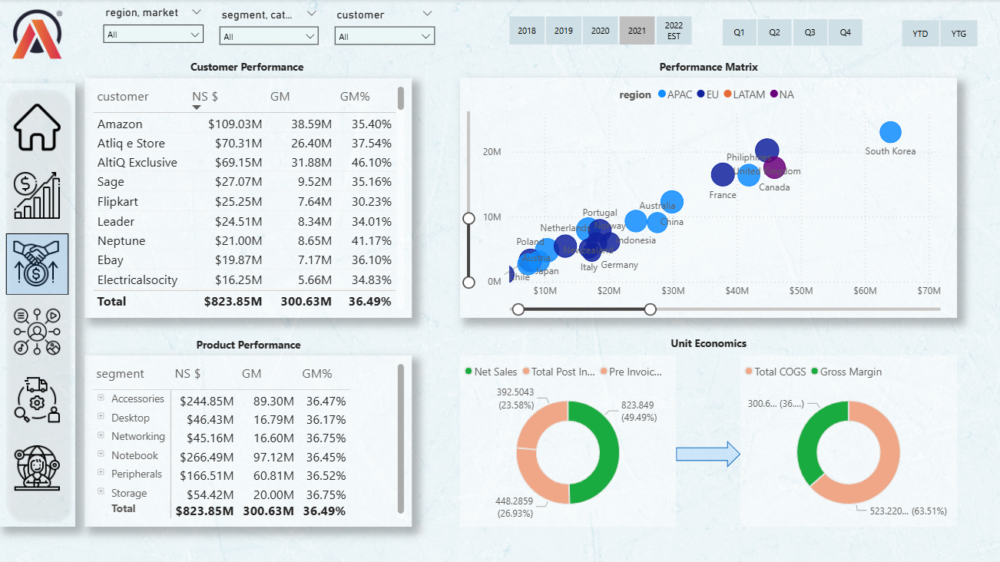
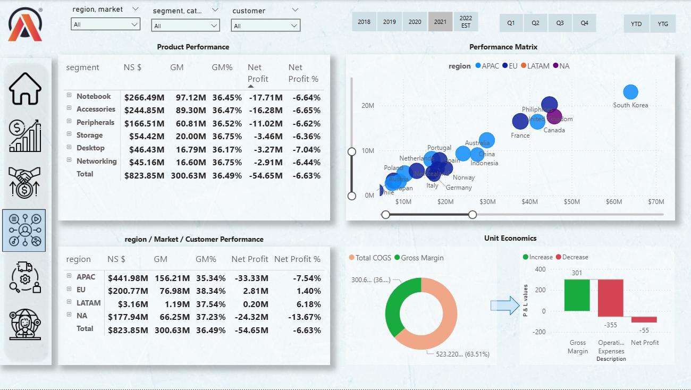

# Business-360-Sales-Revenue-Analytics
End-to-end Power BI sales, revenue &amp; supply chain analytics dashboard

🔹 Project Overview

Business Insight 360 is an end-to-end Power BI analytics solution that aims to give a complete picture of sales, revenue, profitability, and supply chain performance by integrating offline and e-commerce sales data.

The dashboard assists users in tracking financial performance, customer behavior, product profitability, and forecast accuracy for regions and time periods.

🎯 Business Objectives

Monitor Net Sales, Gross Margin, and Net Profit

Compare Target vs Actual performance

Identify top & bottom performing products and customers

Analyze regional contribution and growth trends

Track forecast accuracy and inventory risk

🛠 Tech Stack

Power BI – Dashboarding & data modeling

MySQL – Data source

Excel – Data validation & support

Power Query – Data cleaning & transformation

## 📷 Dashboard Preview

### 🏠 Home Dashboard

### 💰 Finance Dashboard

### 📦 Sales Dashboard

### 📊 Marketing Dashboard

### 🚚 Supply Chain Dashboard

📈 Key Dashboards & Insights

🏠 Home Page

Central navigation hub

Quick access to Finance, Sales, Marketing & Supply Chain views

💰 Finance View

Net Sales, Gross Margin %, Net Profit %

Detailed Profit & Loss Statement

Month-wise Net Sales trend analysis

📦 Sales View

Customer-wise and Product-wise performance

Net Sales, Gross Margin, and GM%

Growth & profitability matrix by region

📊 Marketing View

Product profitability analysis

Market & regional performance

Net Profit contribution by segment

🚚 Supply Chain View

Forecast Accuracy %

Net Error tracking

Inventory risk (Out-of-Stock / Excess Inventory)

Accuracy vs Error trend analysis

⚙️ Data Modeling & Automation

Automated data cleaning using Power Query

Created calculated measures for:

Net Sales

Gross Margin

Net Profit %

Forecast Accuracy

Optimized data model for performance and scalability

📌 Business Impact

Reduced manual reporting effort

Improved executive decision-making

Enabled data-driven revenue & profitability tracking

Identified forecasting gaps and inventory risks

 📂 Power BI File

Due to file size limitations, the Power BI (.pbix) file is hosted externally.

🔗 Power BI PBIX File:

https://drive.google.com/file/d/15R7wWOVQmZYQgiJaMf4WCRv1FjwXQjQL/view?usp=sharing
